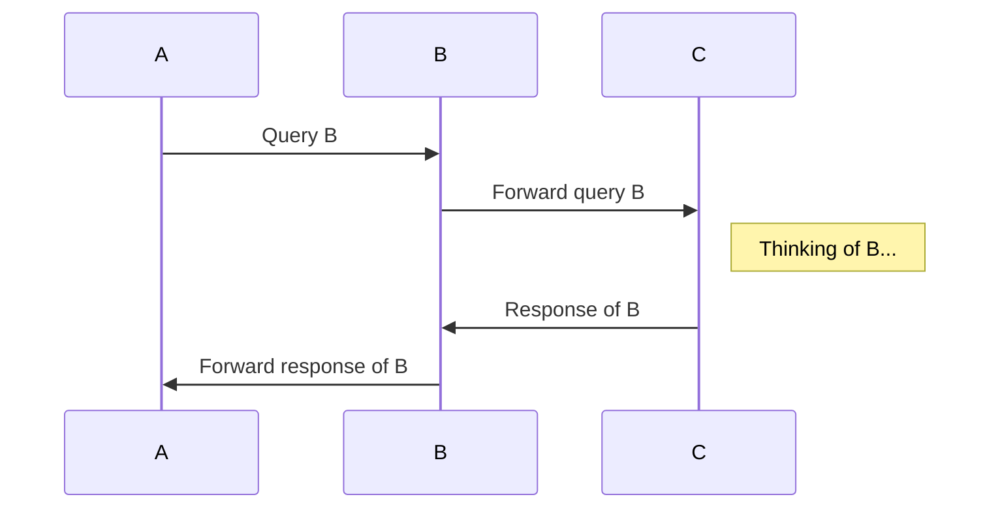

# usd-gem

ok

# Alternative mermaid-diagrams

https://github.com/neosdutertre/mermaid-diagrams/blob/master/README.md

```mermaid
sequenceDiagram
  A->> B: Query B
  B->> C: Forward query B
  Note right of C: Thinking of B...
  C->> B: Response of B
  B->> A: Forward response of B
```
